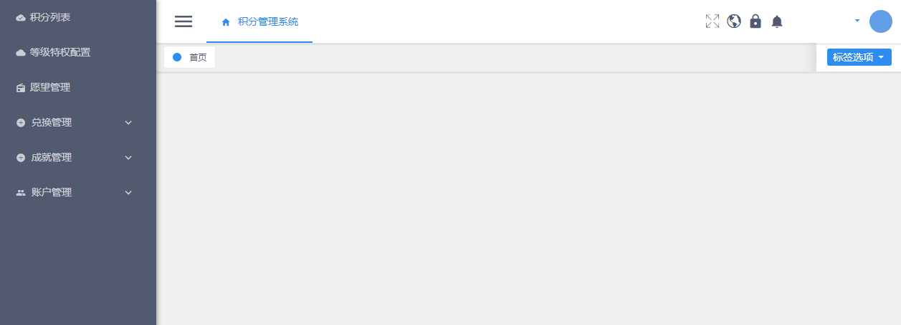
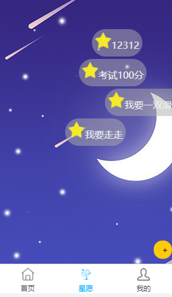
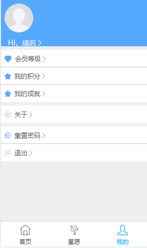

# 简介

[English introduction](./README_EN.md)

## 功能说明
  本项目主要打造了家庭中的积分系统——家庭慧，项目分为client、admin、service三个子项目。目的是实现儿童通过正向的行为获取积分增长，可获取一些行为特权、愿望实现、积分兑换等功能。
  > 如果对您有帮助，您可以点右上角 "Star" 支持一下 谢谢！ ^_^  
  > 如果你也想参与，请fork项目并一起交流吧

## 目标功能
对于admin
- 登录、查询用户信息——已完成
- 等级、兑换等各类积的查询——已完成
- 愿望查询——已完成
- 配置等级以及说明——已完成
- 配置兑换商城的产品——已完成
- 成就、勋章查询和配置——已完成
- 账户管理
  
对于client
- 许愿池的添加和查看——已完成
- 个人等级和兑换积分查询——已完成
- 商城产品兑换——已完成
- 个人成就查询——已完成
- 提交行为申请，并会根据内容自动分类审批

## 技术栈
对于admin
- vue全家桶
- iview design

对于client
> 该项目后面计划支持Android和IOS，技术栈会调整为flutter或者uniapp

对于service
- egg.js
- TypeScript
- mysql

## 部分功能截图
### admin  
 
### client  
  
 

## 运行项目
* git clone https://github.com/betty-chan/integral
* cd integral

> 运行service项目

* 请确保本地已装mysql，并配置全局变量
* mysql -u root -p 并输入数据库密码
* create database learn; 创建learn数据库
* use learn;  切换数据库
* source integral.sql的路径; 例如：source /integral/db/integral.sql;
* 配置egg.js连接数据库信息

```javascript
// 前往service/config/config.local.ts，配置你的数据库信息
config.sequelize = {
    dialect: 'mysql',
    host: '127.0.0.1',
    port: 3306,
    database: 'integral',
    username: '', 
    password: '', 
    operatorsAliases: false
};
```

* 配置七牛云上传鉴权信息

```javascript
// 前往/service/app/service/qiniu.ts，配置你的七牛云获取token信息
export default class qiniuService extends Service {
    // 前往七牛云的个人面板=>秘钥管理查看
    private accessKey: string = ''; // 秘钥
    private secretKey: string = ''; // 秘钥
    private publicBucketDomain = ''; // 外链默认域名
    private options: qiniuOptioin = {
        scope: '', // 上传空间
        expires: 7200
    }
}
// 七牛云存储空间区设置，前往/client/src/components/upload/index.js，配置上传区
class Upload extends React.Component{
    uploadFn = async () => {
        var config = {
            region: qiniu.region.z0 // 所属区，可前往七牛云文档查看
        };
}
```

* cd service
* npm install
* npm run dev

> 运行admin项目

* cd admin
* npm install
* npm run dev

> 运行client项目

* 下载HBuilderX，打开项目，点击运行

# 项目运营说明
